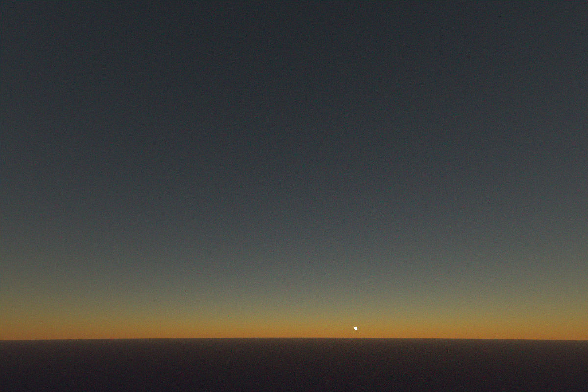
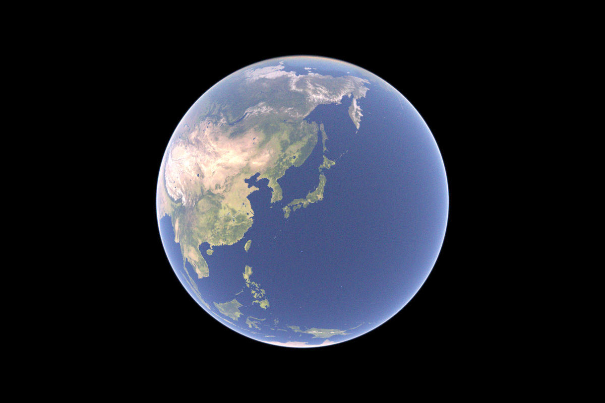

# sky-simulator

This is a path tracer for simulating the sky and Earth.

## Features

- Unidirectional pathtracing
- Spectral rendering
- Heterogeneous medium (atmosphere)
- Next event estimation
- Rayleigh and Mie scattering

## Dependencies

- bmp: https://github.com/sondrele/rust-bmp
- rayon: https://github.com/rayon-rs/rayon
- zune-jpeg: https://github.com/etemesi254/zune-image/tree/dev/crates/zune-jpeg
- tiff: https://github.com/image-rs/image-tiff

## Usage

```sh
git clone git@github.com:Goomasa/sky-simulator.git
cd sky-simulator

cargo run --release
```

If you would like to use textures of Earth, make a directory "assets" and download "2k_earth_daymap.jpg", "2k_earth_specular_map.tif" and "2k_earth_normal_map.tif" from https://www.solarsystemscope.com/textures/

## Gallery






Textures of Earth (2k_earth_daymap.jpg, 2k_earth_specular_map.tif, 2k_earth_normal_map.tif):

> © Solar System Scope. licensed under CC BY 4.0

> [https://www.solarsystemscope.com/textures/](https://www.solarsystemscope.com/textures/)


## References

- Fernando García Liñán, Adolfo Muñoz Orbañanos. Physically-Based Sky and Atmosphere Rendering
in Real-Time. Master in Robotics, Zaragoza University
(January 27, 2023)

- Anthony Bucholtz. Rayleigh-scattering calculations for the terrestrial
atmosphere. In: Applied Optics 34.15 (May 20, 1995), pp. 2765–2773.

- Matt Pharr, Wenzel Jakob, and Greg Humphreys. Physically Based Rendering: From Theory To Implementation. 
https://pbr-book.org/4ed/contents

- Sébastien Hillaire. A Scalable and Production Ready Sky and Atmosphere Rendering Technique. 
Eurographics Symposium on Rendering 2020

- https://qiita.com/Penguin_Ice/items/37845fe3e2622ca4d2fb

- https://rayspace.xyz/CG/